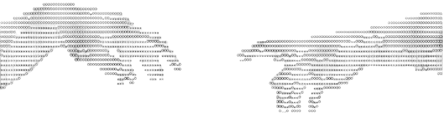

**CEHv13 | CRTA | CAP v2 | CNSP | CAPC | EHE | Penetration Tester | Ethical Hacker | ISO 27001:2022 | IT GRC**

---

### Mobile Development

  
  
  
  
  

### Web Development

  
  
  
  
  

### Core Languages & Systems Programming

  
  
  
  
  
  
  
  

### Cybersecurity & Infrastructure

  
  
  
  
  
  

### Environments & Tools

  
  
  
  
  
  
  

